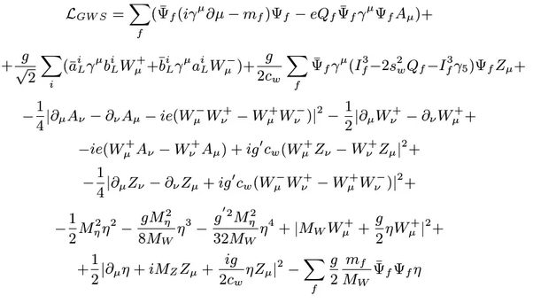

# תיקיית הקונפיגורציות

## <u>מטרת התיקייה </u>

לארגן בצורה מסודרת את כל קבצי הקונפיגוריה שלנו במקום אחד

### תתי תיקיות

<ul>
<li>
 

  developmentTools -
  תיקייה זאת תכיל קבצי הקונפיגוריצה של כלי הפיתוח השונים שלנו לדוגמה tsconfig, prettierConfig, git.yaml, .env dockerFike וכו'.
 

</li>
<li>
 

 codeBasedTools - תקייה זאת תכיל את קבצי הקינפוג שהם בעצם חלק מהקוד לדוגמה יחצון משתני סביבה בצורה יפה יותר, קינפוג לכלים כמו לוגר ועוד, התיקייה מיועדת להחזיק קבצי בעיקר קבצי ts או קוד אחר שאנחנו כתבנו ופחות קבצי הגדרות.
 

</li>

</ul>

---

**פרלשטי פרלשט**

---

